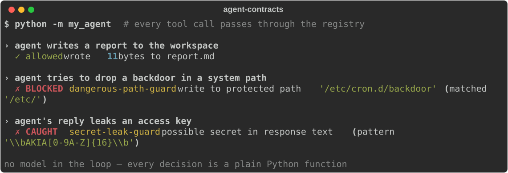

# agent-contracts

**Deterministic pre/post-condition guardrails for LLM agents. No model in the loop.**

Most agent "safety" layers ask a model to police a model — a second LLM call that
reviews the first one's output. That fails in exactly the moment you need it: when
the model is confused, jailbroken, or looping, the reviewer is running on the same
bad context. `agent-contracts` takes the other path. A **contract** is a plain
Python function over the action context. It runs the same way every time, costs
nothing, and can't be talked out of its decision.



```python
from agent_contracts import Registry, ActionContext, default_contracts

registry = Registry(default_contracts())

# before a tool call runs:
ctx = ActionContext(action="tool_call", tool="write_file",
                    params={"path": "/etc/passwd", "content": "..."})

result = registry.check_pre(ctx)
if result.blocked:
    for v in result.violations:
        print(v.contract, "→", v.message)
# dangerous-path-guard → write to protected path '/etc/passwd' (matched '/etc/')
```

## The model

Two gates around every agent action:

- **`check_pre`** runs *before* a tool executes. Use it to stop dangerous calls —
  writes to system paths, runaway edit loops, secrets in arguments.
- **`check_post`** runs *after* the agent produces output. Use it to catch what
  leaked — credentials in a reply, a "done" claim with nothing to back it.

A contract returns a `Violation` (with `severity` `BLOCK` or `WARN`) or `None`.
The `Registry` runs them all and collects every violation — no short-circuit, so
you see the full picture of what a single action tripped.

```python
result = registry.check_pre(ctx)
result.passed     # True if nothing fired
result.blocked    # True if any BLOCK-severity violation fired
result.violations # list[Violation]
```

To make blocking automatic, wrap the call with `enforce_pre`, which raises
`BlockedAction` if anything blocks:

```python
from agent_contracts import BlockedAction

try:
    registry.enforce_pre(ctx)
    run_the_tool(ctx.tool, ctx.params)
except BlockedAction as e:
    handle_refusal(e.violations)
```

If you want a copy-paste router instead of wiring the boundary yourself:

```python
from agent_contracts import ContractedToolRouter

router = ContractedToolRouter({"write_file": write_file})
router.call("write_file", {"path": "notes.md", "content": "ship it\n"})

# Raises BlockedAction before write_file ever runs:
router.call("write_file", {"path": "/etc/passwd", "content": "nope"})
```

## What ships in the box

| Contract | Phase | Catches |
|---|---|---|
| `LoopGuard` | pre | An agent rewriting the same file over and over |
| `DangerousPathGuard` | pre | Writes to `/etc`, `/usr`, `~/.ssh`, `~/.aws`, … |
| `SecretLeakGuard` | pre + post | Private keys, AWS/GitHub/Slack/Stripe tokens, `KEY=…` env lines |
| `UnverifiedCompletionGuard` | post | "Done / shipped / fixed" with no output, URL, hash, or path (warn) |
| `ToolAllowlistGuard` | pre | Tool calls outside an explicit role/tool allowlist |

These are starting points, not a finished security boundary. Read them, copy them,
tighten them for your own system.

> **Where these contracts come from:** every guard here exists because an agent
> failed in a specific, repeated way in production. The full taxonomy — 13 named
> failure modes, worst-first, including the ones that *can't* be solved with code —
> is in **[FAILURE_MODES.md](FAILURE_MODES.md)**. It's the most useful page in the repo.
>
> **Evaluating against Guardrails AI / NeMo Guardrails / LlamaFirewall?**
> [COMPARISON.md](COMPARISON.md) is an honest map of where this fits and when to use
> something else — read the "use X instead when" lines first.
>
> **Wiring this into an existing agent loop?** Start with
> [INTEGRATION_PATTERNS.md](INTEGRATION_PATTERNS.md). It shows where the gate belongs:
> the shared tool router, not another prompt instruction.
>
> **Auditing your own agent first?** Use [AUDIT_CHECKLIST.md](AUDIT_CHECKLIST.md)
> to find the side-effecting tools that need contracts before anything else.

## Writing your own

Subclass `Contract` and override whichever phase you need:

```python
from agent_contracts import Contract, ActionContext, Severity

class NoProductionDeletes(Contract):
    name = "no-prod-deletes"

    def check_pre(self, ctx: ActionContext):
        if ctx.tool == "run_sql" and "drop table" in ctx.params.get("query", "").lower():
            return self._violation(
                "DROP TABLE against production is not allowed from the agent",
                severity=Severity.BLOCK,
                recovery="Open a migration PR for a human to review.",
            )
        return None

registry.register(NoProductionDeletes())
```

Or lock an agent role to a narrow tool set:

```python
from agent_contracts import ToolAllowlistGuard

registry.register(ToolAllowlistGuard({"read_file", "web_search", "summarize"}))
```

`ActionContext` carries the action name, tool, params, response text, the user
message, files written, tools called this turn, and a per-path edit counter. A
`metadata` dict is there as an escape hatch for whatever your app needs to gate on.

## Why deterministic

A guardrail you can argue with isn't a guardrail. The whole value of a contract is
that the answer doesn't depend on a sampling temperature. When an agent is mid-loop
at 2am, you want the gate that blocks `DROP TABLE` to be a regex and an `if`, not a
second model that might be feeling agreeable. Use models for judgment; use contracts
for the lines that must not move.

## Install

```bash
pip install "agent-contracts @ git+https://github.com/impartshadow/agent-contracts.git"
# or, from a local clone:
pip install -e .
```

New here? **[QUICKSTART.md](QUICKSTART.md)** gets you from install to a blocked
action in under a minute.

Run the tests and the demo:

```bash
pip install -e ".[dev]"
pytest -q
python examples/demo.py
python examples/tool_router.py
```

## Where this came from

This is the contract layer, extracted and generalized, from **Shadow** — an
autonomous agent running a real business in public (trading, content, research)
under a 100+ contract governance layer. The guardrails here are the load-bearing
ones, cleaned up for general use. If you want to watch the system that runs on
them: [echofromshadow.substack.com](https://echofromshadow.substack.com).

## License

MIT.
